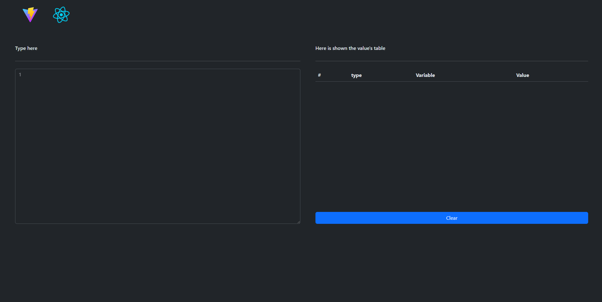
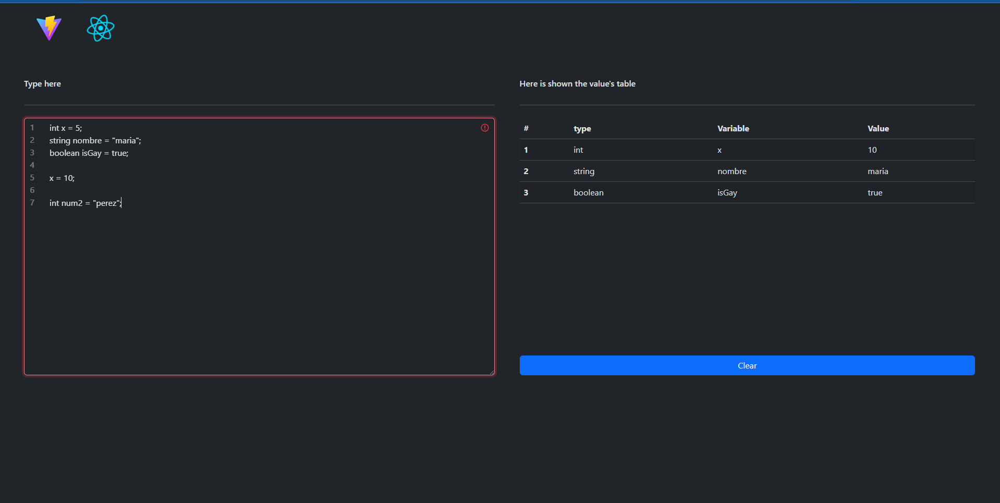
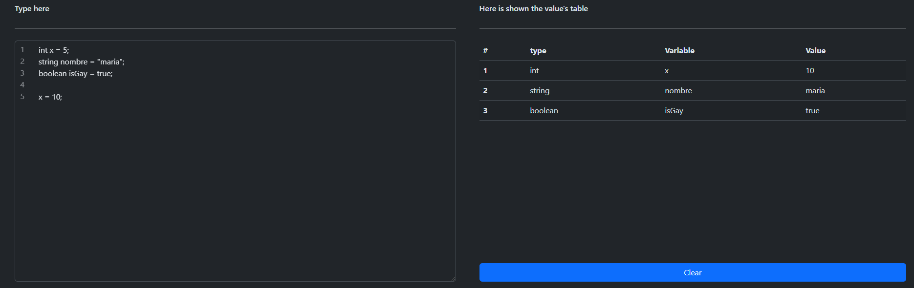

# Verificador de Sintaxis en React con Vite

Este es un pequeño proyecto que fue desarrollado como parte de la asignatura de Lenguajes y Autómatas, por Darien Verdugo. Es un pequeño programa en React con Vite que realiza verificación de sintaxis, similar a la funcionalidad que ofrece Visual Studio Code pero de forma mas limitada.

## Funcionalidades

- **Verificación de Sintaxis:** La aplicación permite a los usuarios ingresar código y verifica la sintaxis, proporcionando retroalimentación inmediata sobre posibles errores de forma limidad con "Cues" visuales.

## Requisitos

- Node.js: Asegúrate de tener Node.js instalado. Puedes descargarlo desde [https://nodejs.org/](https://nodejs.org/)

## Instrucciones de Uso

## con npm

1. Clona este repositorio: `git clone https://github.com/NecroPrism4/syntax_checker`
2. Instala las dependencias: `npm install`
3. Inicia la aplicación: `npm run dev`
4. Abre tu navegador y visita [http://localhost:5173](http://localhost:5173)

### Con Docker Compose

1. Necesitara contar con docker engine y el plugin de docker compose.
2. Clona este repositorio: `git clone https://github.com/tuusuario/turepo.git`
3. Ejecuta la aplicación con Docker Compose: `docker-compose up`

## Capturas de pantalla

